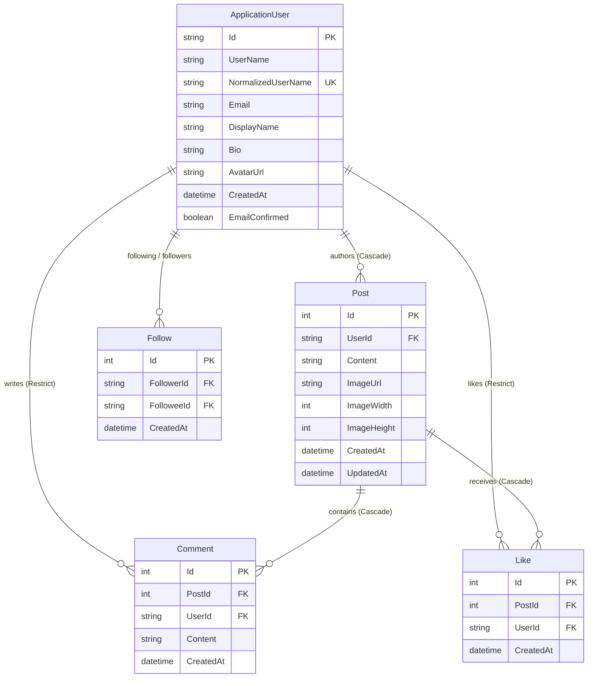

# SocialApp — Modern Social Media Platform

A fast, accessible, server-rendered Social Media Platform built with **ASP.NET Core MVC (.NET 10)**, **Entity Framework Core 10**, and a **handcrafted Vanilla CSS/JS design system**.

Developed by **Haider Zaman** for the **CodeAlpha Internship** (Task 2).

---

## 🌟 Highlights & UX Differentiators

Most mainstream social platforms (X, Instagram, Facebook) suffer from UX anti-patterns, invasive tracking, and algorithmic manipulation. SocialApp deliberately fixes 11 specific design flaws:

| # | UX Flaw in Mainstream Platforms | SocialApp Solution |
|---|---------------------------------|-------------------|
| 1 | **Invisible Keyboard Focus** (X, Instagram) | A consistent, high-contrast `:focus-visible` ring across every interactive element for full keyboard accessibility. |
| 2 | **Cramped 32px Nav Rows** (X) | 48px touch/click targets exceeding the 44px accessible minimum. |
| 3 | **Uninformative Error Strings** | Errors written in the application's natural voice explaining *what happened* and *how to fix it*. |
| 4 | **Ambiguous "2h" Timestamps** (X) | Relative time by default; hover/focus displays the exact ISO timestamp converted automatically to the reader's local timezone. |
| 5 | **Feed Jumping on Image Load** (Facebook) | Exact image pixel dimensions stored in DB and rendered inline with `width`, `height`, and `aspect-ratio` for **zero layout shift (CLS: 0)**. |
| 6 | **Addictive Infinite Scroll Doomloop** | Clean, finite pagination (10 posts per page) with an explicit *"That's everything"* end indicator. |
| 7 | **Ambiguous "For You / Following" Tabs** (X) | High-contrast segmented control with an unambiguous selected state. |
| 8 | **Ambiguous Follow Button State** (X) | Shows "Following" (the current state); smoothly swaps to "Unfollow" on hover/focus via CSS `::after` without button width changes. |
| 9 | **No Direct Post URL & Broken Modals** (Instagram) | Every post has a permanent, shareable, SEO-friendly permalink at `/p/{id}`. |
| 10 | **Comment Box Buried Under Threads** (Facebook) | The comment composer is anchored *above* the comment list, eliminating tedious scrolling. |
| 11 | **SQL Server UTC Timezone Bugs** | All timestamps are normalized via a dedicated `PostedAt.AsUtc()` layer to prevent silent 5-hour offset bugs caused by `DateTimeKind.Unspecified`. |

---

## 🚀 Features

- **Authentication & Security:**
  - ASP.NET Core Identity with mandatory email confirmation (`RequireConfirmedAccount = true`).
  - Real-time DNS MX record lookup via `DnsClient` to catch typos in email domains (e.g. `gmail.con`).
  - Branded HTML emails for account confirmation and onboarding welcome.
  - Safe diagnostics mode in development (shows secret shape without leaking credentials).

- **Feeds & Content Creation:**
  - **Home Feed:** Chronological posts from followed accounts + own posts.
  - **Explore Feed:** Global chronological post stream without black-box algorithmic ranking.
  - **Post Permalinks (`/p/{id}`):** Dedicated page with full conversation thread.
  - **Post Composer & Media Pipeline:** Live character counter (500 chars), image attachments processed via `SixLabors.ImageSharp` (auto-orient, EXIF stripped, WebP encoded, max 1280px).
  - **Post Editing:** Author-only edit form allowing text modification, image removal, or image replacement, with `edited` timestamp badge.

- **Social Interactions:**
  - **Likes & Follows:** Single-action toggle endpoints with database-level race protection and progressive enhancement (works with JS disabled; seamless background `fetch` with JS enabled).
  - **Comments:** 300-character threaded comments with live character count, POST-Redirect-GET `#comments` anchoring, and inline moderation delete actions for post owners.
  - **Profiles (`/u/{username}`):** Custom display names, bios, avatars (auto square crop), joined date, post feeds, and clickable follower/following lists.
  - **Followers & Following Lists:** Dedicated tabbed views (`/u/{username}/followers`, `/u/{username}/following`) with user cards and real-time follow toggles.

- **Search:**
  - Tabbed search (`/search?q=...&tab=people` / `posts`) querying `UserName`, `DisplayName`, and `Content`.
  - Escaped wildcard matching, clean empty states, and shareable URL query strings.

- **Design System & Accessibility:**
  - Zero-dependency Vanilla CSS (~1400 lines) driven completely by semantic design tokens.
  - Instant Light/Dark mode toggle with zero-flash pre-paint script.
  - Responsive design tested from 1440px desktop down to 360px mobile screens (bottom navigation rail on mobile).
  - Respects OS-level `prefers-reduced-motion` settings.

---

## 🛠 Tech Stack & Architecture

- **Backend Framework:** ASP.NET Core MVC (.NET 10.0, C# 14)
- **Database Layer:** Entity Framework Core 10 (Code-First) + SQL Server LocalDB / Azure SQL
- **Identity & Auth:** ASP.NET Core Identity (`ApplicationUser : IdentityUser`)
- **Image Processing:** `SixLabors.ImageSharp 4.1.1`
- **Email Delivery:** `MailKit 4.17.0` + `DnsClient 1.8.0` (Singleton MX validation)
- **Frontend:** Server-rendered Razor Views + Handcrafted CSS Tokens + Vanilla JS (No jQuery, no Tailwind, no Bootstrap)

### Performance & Query Optimization
- **Zero N+1 Queries:** Feeds and profiles use unified `.Select()` projection expressions translating to SQL correlated subqueries for likes and comments count.
- **Read-Only Speed:** All query endpoints use `AsNoTracking()`.
- **Keyset-Safe Paging:** `OrderByDescending(CreatedAt).ThenByDescending(Id)` with `Take(PageSize + 1)` to eliminate expensive `COUNT(*)` table scans.
- **Pluggable Storage:** `IImageStorage` interface enables seamless local disk storage in development and Azure Blob Storage in production.

---

## 📊 Database Schema (Entity Relationship)



---

## 💻 Local Setup Guide

### Prerequisites
- [.NET 10.0 SDK](https://dotnet.microsoft.com/download)
- [SQL Server Express / LocalDB](https://learn.microsoft.com/en-us/sql/database-engine/configure-windows/sql-server-express-localdb)

### 1. Clone the Repository
```powershell
git clone https://github.com/Haider-523/CodeAlpha_SocialMediaPlatform.git
Set-Location "CodeAlpha_SocialMediaPlatform\SocialApp"
```

### 2. Configure Local Secrets (User Secrets)
SMTP credentials and private settings are kept out of source control. Configure your local dev environment via `dotnet user-secrets`:

```powershell
dotnet user-secrets init
dotnet user-secrets set "Smtp:UserName" "your-email@gmail.com"
dotnet user-secrets set "Smtp:Password" "paste-your-16-char-app-password-here"
dotnet user-secrets set "Smtp:FromEmail" "your-email@gmail.com"
```

> **Note:** In Development mode, if SMTP is not configured, the account confirmation link is also printed in a diagnostics box directly on screen for testing ease.

### 3. Apply Database Migrations
```powershell
dotnet ef database update
```

### 4. Run the Application
```powershell
dotnet run
```
Open your browser at: `http://localhost:5137`

---

## 📁 Project Structure

```
CodeAlpha_SocialMediaPlatform/
├── CodeAlpha_SocialMediaPlatform.slnx
├── README.md
└── SocialApp/
    ├── Program.cs
    ├── appsettings.json
    ├── Controllers/
    │   ├── AccountController.cs       # Registration, Email Confirmation, Login, Logout
    │   ├── HomeController.cs          # Following Feed, Welcome landing, Error handling
    │   ├── ExploreController.cs       # Global chronological feed
    │   ├── ProfileController.cs       # Profiles, Avatar uploads, Followers/Following lists
    │   ├── PostsController.cs         # Post Details, Create, Edit, Delete
    │   ├── LikesController.cs         # Like/Unlike AJAX toggle
    │   ├── FollowController.cs        # Follow/Unfollow AJAX toggle
    │   ├── CommentsController.cs      # Comment creation & moderation deletion
    │   └── SearchController.cs        # People & Posts tabbed search
    ├── Data/
    │   └── ApplicationDbContext.cs    # EF Core schema, cascade rules, unique indexes
    ├── Models/
    │   ├── Entities/                  # ApplicationUser, Post, Comment, Like, Follow
    │   └── ViewModels/                # PostedAt, PostViewModel, SearchViewModel, etc.
    ├── Services/
    │   ├── FeedService.cs             # Centralized feed & search queries with projections
    │   ├── LocalImageStorage.cs       # ImageSharp WebP pipeline & storage
    │   ├── SmtpEmailSender.cs         # MailKit SMTP delivery
    │   └── DnsEmailDomainValidator.cs # Real-time MX DNS lookup
    ├── Views/                         # Razor views matching design tokens
    └── wwwroot/
        ├── css/site.css               # Token-driven CSS design system (~1400 lines)
        └── js/site.js                 # Progressive enhancement, character counters, previews
```

---

## 📄 License
This project is developed for educational purposes as part of the **CodeAlpha Internship program**.